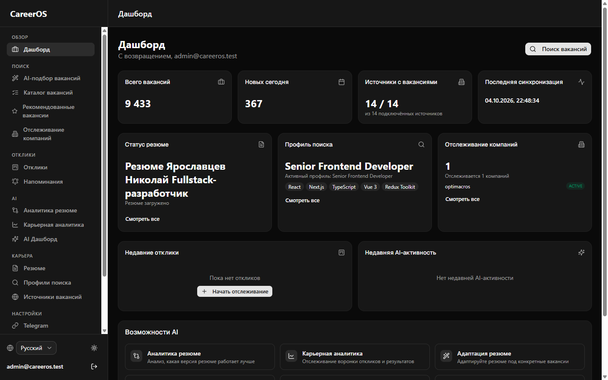

# CareerOS
**Русский** · [English](README.en.md)

CareerOS это карьерное рабочее пространство: оно ищет вакансии на job-платформах
за вас, дедуплицирует и сохраняет их, сопоставляет с вашим резюме с помощью ИИ
и показывает ранжированные рекомендации в дашборде (и, по желанию, в Telegram).

Production-grade пет-проект, написанный в одиночку: Fastify API, Next.js дашборд
и BullMQ воркер с общим доменным слоем.




## Основное

- **28 job-провайдеров и ATS-платформ**: Greenhouse, Lever, Ashby, Workday,
  Teamtailor, SmartRecruiters, Workable, Recruitee, Comeet, Personio, HH.ru,
  SuperJob, Habr Career, LinkedIn, Telegram-каналы и другие, у каждой свои
  fetcher/mapper/normalizer и набор тестов поверх общего интерфейса `Provider`.
- **ИИ-сопоставление с резюме** через пять взаимозаменяемых провайдеров (OpenAI,
  Anthropic, Groq, Gemini, OpenRouter) с автоматическими цепочками fallback.
- **39 Architecture Decision Records**: каждое нетривиальное проектное решение
  описано с контекстом и компромиссами, так что логику архитектуры можно изучать
  так же, как и сам код.
- **363+ автоматических тестов** (unit, integration, contract, e2e), которые
  Turborepo запускает для каждого пакета.

## Архитектура

TypeScript-монорепозиторий (pnpm + Turborepo) из трёх разворачиваемых приложений
и общего доменного слоя:

- `apps/backend`: REST API на Fastify: аутентификация, поиск и сохранение
  вакансий, управление резюме и откликами.
- `apps/worker`: фоновый обработчик на BullMQ: синхронизация провайдеров,
  ИИ-сопоставление, адаптация резюме, уведомления.
- `apps/dashboard`: интерфейс на Next.js для поиска, откликов и анализа резюме.
- `packages/*`: доменная логика, адаптеры провайдеров, оркестрация ИИ, слой базы
  данных и общий конфиг и инфраструктурный код, которые используют все три приложения.

Backend, worker и dashboard общаются через Postgres и очереди BullMQ на Redis, а
не вызывают друг друга напрямую, поэтому синхронизация провайдеров и ИИ-анализ
выполняются асинхронно и не блокируют API и интерфейс. Полное описание дизайна
смотрите в [`docs/`](docs/README.md) и [`adr/`](adr/).

## Быстрый старт

Шаги ниже поднимают проект локально. Если вы просто смотрите код и не собираетесь
его запускать, переходите к разделу [Структура проекта](#структура-проекта).

Требования: Node.js 22+, pnpm 9.15+, Docker Desktop, Git.

```bash
# 1. Install dependencies
pnpm install

# 2. Copy env templates
cp .env.example .env
cp apps/dashboard/.env.example apps/dashboard/.env.local

# 3. Start infrastructure (Postgres, Redis, MinIO, Mailpit, pgAdmin)
docker compose up -d

# 4. Apply database migrations (+ seed the default workspace)
pnpm db:migrate
pnpm db:seed

# 5. Start everything (backend + dashboard)
pnpm dev
```

Затем откройте дашборд по адресу **http://localhost:3001** и либо зарегистрируйте
новый аккаунт, либо войдите под демо-аккаунтом из seed:

```
email:    demo@careeros.dev
password: CareerOSDemo2026!
```

Этот аккаунт создаёт `pnpm db:seed` только в режиме разработки, у него роль `ADMIN`
и нет персональных данных. Он нужен для знакомства с репозиторием, а не для
настоящего пользователя.

HH (hh.ru) не требует настройки и всегда включён, поэтому свежий клон может сразу
искать реальные вакансии: для этого API-ключи не нужны. Для ИИ-сопоставления нужен
один API-ключ (см. [Настройка ИИ](#настройка-ии) ниже); без него поиск и сохранение
работают, пропускается только ИИ-анализ.

### Вариант только на Docker

`docker-compose.full.yml` запускает весь стек (Postgres, Redis, MinIO, Mailpit,
миграции, backend, worker и dashboard) в контейнерах, локальный `pnpm dev` не нужен:

```bash
pnpm docker:full:up    # docker compose -f docker-compose.full.yml up -d --build
```

Затем откройте `http://localhost:3001`. Это отдельный стек, не связанный с
`docker compose up -d` + `pnpm dev` (у них разные тома Postgres/Redis/MinIO, поэтому
аккаунты между ними не переносятся). Не запускайте оба сразу, они публикуют одни и
те же порты хоста. Подробности в
[`docs/LOCAL_DEVELOPMENT.md`](docs/LOCAL_DEVELOPMENT.md#docker-only-workflow-no-local-pnpm-dev).

## Что запускается и где

| Сервис     | URL                   | Назначение                                                                                                                         |
| ---------- | --------------------- | ---------------------------------------------------------------------------------------------------------------------------------- |
| Backend    | http://localhost:3000 | Fastify API (`/health`, `/api/v1/...`)                                                                                             |
| Worker     | http://localhost:3002 | Обработчик задач BullMQ (HTTP только для health-проверки)                                                                          |
| Dashboard  | http://localhost:3001 | Интерфейс на Next.js                                                                                                               |
| PostgreSQL | localhost:5432        | Основная база данных                                                                                                               |
| Redis      | localhost:6379        | Кэш и очереди BullMQ                                                                                                               |
| MinIO      | http://localhost:9001 | Консоль объектного хранилища (развёрнуто, но пока не подключено ни к одной функции: загрузки резюме сейчас идут на локальный диск) |
| Mailpit    | http://localhost:8025 | Перехватывает исходящую почту, настоящий SMTP не нужен                                                                             |
| pgAdmin    | http://localhost:5050 | Интерфейс администрирования БД (локальные учётные данные по умолчанию, см. `docker-compose.yml`)                                   |

## Переменные окружения

`.env.example` в корне репозитория описывает все переменные, которые читают backend
и worker (у них один общий корневой `.env`; почему так, см.
[`docs/LOCAL_DEVELOPMENT.md`](docs/LOCAL_DEVELOPMENT.md#environment-variable-loading)).
Дашборд написан на Next.js и требует собственный `apps/dashboard/.env.local`
(шаблон лежит в `apps/dashboard/.env.example`), потому что Next.js загружает env-файлы
только из каталога своего приложения.

Для запуска backend строго необходимы только две переменные:

- `DATABASE_URL`: по умолчанию указывает на Postgres из `docker compose up -d`.
- `JWT_SECRET`: не короче 32 символов; `.env.example` содержит заглушку, для любого использования кроме локального её нужно заменить.

Всё остальное (Redis, MinIO, SMTP, ИИ, Telegram, все job-провайдеры) имеет рабочее
значение по умолчанию или корректно отключается, если не задано.

### Настройка провайдеров

Полная таблица в [`docs/LOCAL_DEVELOPMENT.md#job-providers`](docs/LOCAL_DEVELOPMENT.md#job-providers).
Кратко: HH ничего не требует и всегда включён; Greenhouse, Lever, Ashby, Workday и
Teamtailor требуют идентификатор board/tenant и молча пропускаются (с предупреждением
в логах при старте), если он не задан, но никогда не приводят к падению.

### Настройка ИИ

Задайте `AI_PROVIDER` (`openai` | `anthropic` | `groq` | `gemini` | `openrouter`) и
соответствующий `*_API_KEY`. Цепочки fallback, таймауты и лимиты параллельности
описаны в [`docs/LOCAL_DEVELOPMENT.md#ai-providers`](docs/LOCAL_DEVELOPMENT.md#ai-providers).
Подпроверка `ai` в `GET /health` показывает, настроен ли ключ у выбранного провайдера
(это проверка конфигурации, а не живой вызов, поэтому она не расходует квоту API при
каждом опросе health).

Задайте `AI_ENABLED=false`, чтобы полностью отключить ИИ-сопоставление и очередь
анализа вакансий. Тогда `POST /intelligence/search` сразу возвращает сохранённые
вакансии без оценок. Это удобно для работы над интерфейсом, отладки провайдеров и
smoke-тестов, когда не хочется тратить квоту ИИ-провайдера. По умолчанию `true`.
О том, почему поиск не ждёт ИИ-сопоставления даже при включённом ИИ, см.
[ADR-026](adr/ADR-026-decoupled-vacancy-search.md).

## Локальный запуск

В повседневной работе, когда всё уже настроено:

```bash
docker compose up -d
pnpm dev
```

Чтобы запустить одно приложение: `pnpm --filter @careeros/backend dev`,
`pnpm --filter @careeros/worker dev` или `pnpm --filter @careeros/dashboard dev`.

Подробности (демо-скрипты, сброс базы данных, правила загрузки переменных окружения,
решение проблем) в [`docs/LOCAL_DEVELOPMENT.md`](docs/LOCAL_DEVELOPMENT.md).

## Частые проблемы

- **Порт уже занят**: другой процесс использует 3000/3001/5432/6379/9000-9001/8025/5050. Найдите и остановите его или остановите другой стек CareerOS (`docker compose down` / `pnpm docker:full:down`).
- **`/health` или `/ready` возвращают 503**: проверьте `docker compose ps`; убедитесь, что `DATABASE_URL`/`REDIS_URL` в `.env` совпадают с портами, которые реально открывает Docker.
- **Backend не стартует: "Invalid environment variables"**: `JWT_SECRET` отсутствует или короче 32 символов, либо не задан `DATABASE_URL`. Проверьте, что `.env` существует и скопирован из `.env.example`.
- **Поиск вакансий работает, но ИИ-анализа нет**: для `AI_PROVIDER` не задан `*_API_KEY`, либо не запущен worker (`pnpm --filter @careeros/worker dev` или проверьте `docker compose -f docker-compose.full.yml ps worker`). Вакансии всё равно сохраняются; шаг сопоставления пропускается или остаётся в ожидании.
- **Устаревший или недействительный токен после переключения между `pnpm dev` и `docker:full`**: два стека используют разные тома базы данных. Дашборд сам определяет нерабочий токен, очищает его и перенаправляет на `/login`.

Другие проблемы (ошибки миграций Prisma, проблемы подключения к Redis/Postgres)
разобраны в [`docs/LOCAL_DEVELOPMENT.md#troubleshooting`](docs/LOCAL_DEVELOPMENT.md#troubleshooting).

## Проверка

```bash
pnpm turbo typecheck
pnpm turbo lint
pnpm turbo test
pnpm turbo build
```

363+ автоматических тестов по всему монорепозиторию (unit, integration, contract,
e2e), которые Turborepo запускает для каждого пакета.

## Структура проекта

```
career-os/
├── apps/
│   ├── backend/          # Fastify API server
│   ├── dashboard/        # Next.js frontend
│   └── worker/           # Background job processor (BullMQ)
├── packages/
│   ├── ai/               # AI provider abstraction (OpenAI, Anthropic, Groq, Gemini, OpenRouter)
│   ├── auth/             # Authentication (JWT + Argon2)
│   ├── career/            # Career domain logic
│   ├── database/         # Prisma ORM + repositories
│   ├── notifications/    # Notification providers
│   ├── providers/        # 28 job providers/ATS adapters (HH, Greenhouse, Lever, Ashby, Workday, Teamtailor, ...)
│   ├── resume/           # Resume parsing
│   ├── shared/           # Config, Redis, health checks
│   └── telegram/         # Telegram bot integration
└── docs/                 # Architecture, ADRs, epics, detailed local dev guide
```
